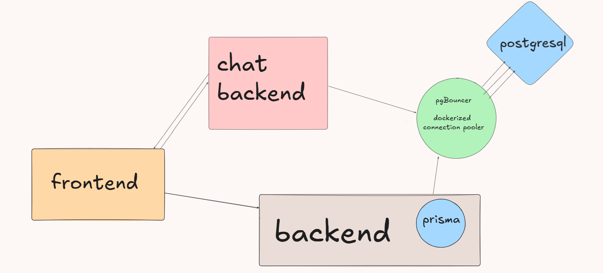
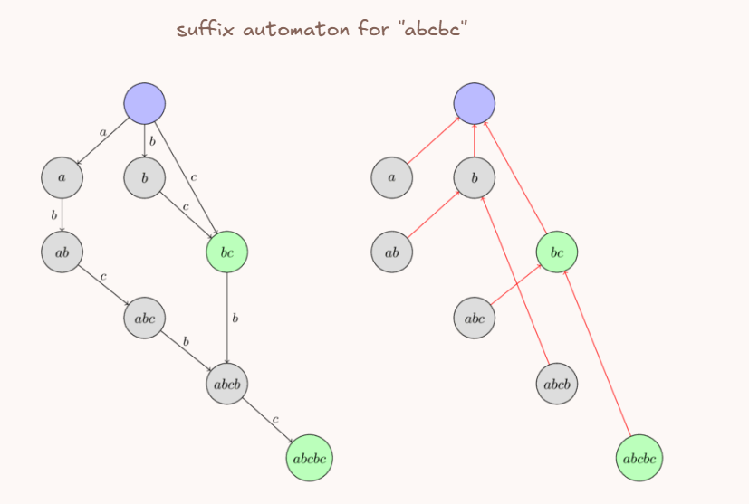
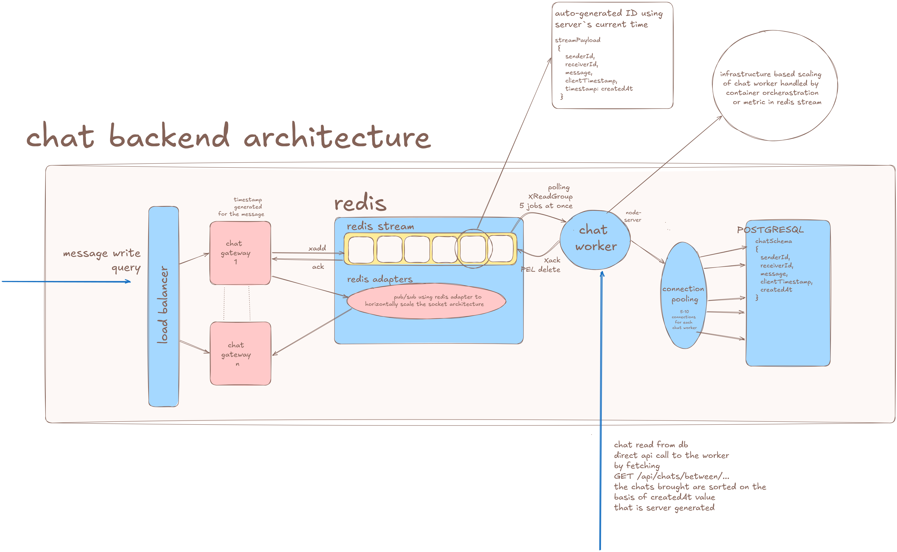
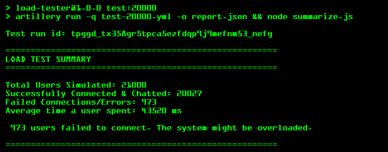

# Alaska: Metro Route-Based Social Network

Alaska is a unique social platform designed to connect commuters who share similar daily routes on the Delhi Metro network. By inputting your daily journey, the platform intelligently matches you with fellow travelers, allowing you to connect, add friends, and chat in real-time.

The architecture of Alaska has been designed as a set of decoupled microservices using modern technologies. The primary focus was on ensuring high availability, scalability, and robust data durability under heavy load, combining system design principles with the implementation of complex data structures.

---

## Architecture Overview

The system is separated into distinct, specialized services orchestrated via Docker Compose. This separation of concerns enables independent scaling and fault tolerance across the platform. The backend environment consists of seven interconnected containers communicating over an internal Docker network.



---

## 1. Frontend Architecture & Optimizations

- **Role:** Provides interactive maps, trip planning, chat interfaces, and complex data structure generation.
- **Technologies:** React 19, Vite, Tailwind CSS v4, shadcn/ui, Zustand, Framer Motion, Mapbox GL.

To ensure highly optimized route matching and optimal server performance, the frontend takes on significant computational responsibilities:

### Station-to-Integer Mapping

To minimize string-matching overhead on the backend and reduce the size of data nodes, the frontend handles the mapping of all 271 Delhi Metro station names to unique integers. Routes are transmitted and processed entirely as integer arrays rather than strings, which significantly saves memory and optimizes processing speed.

### Suffix Automaton (SAM) for Fast Path Matching

Instead of doing linear searches for path overlaps on the server, the frontend constructs a **Suffix Automaton (SAM)**.

- A Suffix Automaton is an advanced data structure capable of storing all contiguous subsegments (or substrings) of a given array in `O(N)` space.
- The SAM is built in `O(size(A))` time complexity. Querying a secondary path against it takes `O(size(B))` time complexity, effectively reducing every route query to linear time.
- Once generated, the SAM is serialized and sent to the backend.


*(Note: The structure maintains one tree for the SAM and another for suffix links used exclusively during the building phase).*
you can read more about suffix automaton [click here](https://cp-algorithms.com/string/suffix-automaton.html)

---

## 2. Core API (Backend)

- **Role:** Handles core business logic, user authentication, trip management, friendships, and reviews.
- **Technologies:** Node.js, Express, Prisma ORM.

The Express framework provides a lightweight and robust foundation for building REST APIs, while Prisma ensures type-safe database queries to prevent runtime errors and improve developer velocity.

By separating the core business logic from real-time chat operations, the primary API remains highly responsive even during high concurrency in chat traffic. The API is also responsible for deserializing the incoming SAM from clients, querying other users' routes (as integer arrays), and returning optimized match results.

---

## 3. Real-Time Chat System

Real-time chat is one of the most resource-intensive features of any social network. We decoupled this into a three-part containerized subsystem to provide horizontal scalability and high message durability.



### Chat Gateway

- **Role:** Manages persistent WebSocket connections using `Socket.io`.
- **Mechanism:** WebSockets hold open connections that can quickly exhaust standard server resources. By isolating connection management to a dedicated Gateway, we can scale it horizontally.
- **Message Flow:** When a message arrives, the Gateway assigns a server-side timestamp for accurate UI ordering. It immediately offloads the message by pushing it into a Redis Stream. Once acknowledged, it publishes the message to a Redis Adapter, which delivers it to the receiving user in real time. This minimizes event loop blocking.

### Redis (Pub/Sub & Streams)

Redis serves a dual purpose critical for scaling:

1. **Cross-Gateway Communication:** Since WebSockets are stateful, User A (connected to Gateway 1) and User B (connected to Gateway 2) cannot natively communicate. We utilize the Redis Adapter with Pub/Sub to seamlessly route messages across different Gateway instances.
2. **Message Durability (Redis Streams):** We utilize Redis Streams (an append-only log) as a high-throughput message queue. If a downstream worker fails, messages are not lost; they remain in the Pending Entries List (PEL) for another worker to safely pick up. We utilize consumer groups (`xreadgroup`) to ensure strict atomicity, guaranteeing that no two workers process the same message.

### Chat Worker

- **Role:** A constantly active background service that safely persists queued messages to the database.
- **Mechanism:** The worker implements a pull-based mechanism using an infinite loop. It first queries the Redis Stream for any stuck/pending messages (PEL Recovery), then blocks to wait for new messages.
- **Optimization:** Database writes are comparatively slow. If the database experiences latency, the Worker absorbs the shock by reading from the Redis queue at its own pace. Once a batch of messages is received, it performs a bulk insert (`prisma.chatMessage.createMany`) into PostgreSQL, significantly reducing database load, followed by a batch acknowledgment to Redis.

---

## 4. Infrastructure & Engineering Decisions

### Why PostgreSQL over MongoDB for Chat?

While NoSQL databases are often popular choices for high-speed chat applications, our architecture solves the write bottleneck upstream using the Gateway-Worker-Queue pattern. Because Redis buffers the high-speed data and the Worker performs batched writes, PostgreSQL handles the load effortlessly.

- **Unified Infrastructure:** Keeping both core user data and chat messages in PostgreSQL simplifies infrastructure.
- **Referential Integrity:** Enforcing strict foreign keys ensures we do not have orphaned chat messages from deleted users.
- **Prisma Synergy:** Prisma ORM's schema management and migration tools are significantly more mature for relational databases.

### Custom Connection Pooling with PgBouncer

Because Node.js services (Core API and horizontally scaled Chat Workers) open multiple database connections rapidly, PostgreSQL can easily suffer from connection exhaustion. We placed **PgBouncer**, a lightweight connection pooler, directly in front of the database to multiplex connections. This significantly improves the stability of the data layer under load.

### Why Local Dockerized Deployment?

Rather than relying on SaaS solutions like Prisma Accelerate, we opted for a fully localized Docker deployment containing PgBouncer and PostgreSQL on the same internal network.

- **Minimal Latency:** Network routing latency between the backend and the database is reduced to sub-millisecond levels.
- **No Vendor Lock-in:** The entire architecture is self-contained and avoids reliance on external proprietary services.
- **Persistent Processing:** Using standard Node.js Express workers instead of serverless edge functions allows our Chat Workers to run the infinite polling loops required for pulling from Redis Streams.

---

### Load Testing Results

The `load-tester` directory contains comprehensive test suites demonstrating the application's resilience and scalability under heavy WebSocket traffic.

Our benchmarks indicate that the architecture can successfully manage up to 20,000 concurrent socket connection attempts. During peak simulated load, the system sustains between 12,000 to 14,000 active, simultaneous WebSocket connections (with each connection persisting for 30 seconds).

You can replicate these tests locally by executing the following command:

```bash
cd load-tester && ulimit -n 65535 && npm run test:20000
```

**Output:**



---

## Getting Started

The entire application environment is containerized using Docker, ensuring that it runs identically on every machine.

### Prerequisites

- [Docker](https://www.docker.com/) and Docker Compose installed on your system.

### Running Local Development

1. Clone the repository to your local machine.
2. Set up your environment variables:
   ```bash
   cp .env.example .env
   ```
3. Start the containers:
   ```bash
   docker-compose up --build
   ```
4. Access the services:
   - Frontend: `http://localhost:8000`
   - Core API: `http://localhost:3000`
   - Chat Gateway: `http://localhost:4001`
   - PostgreSQL, PgBouncer, and Redis will run securely in the background on their respective ports.
