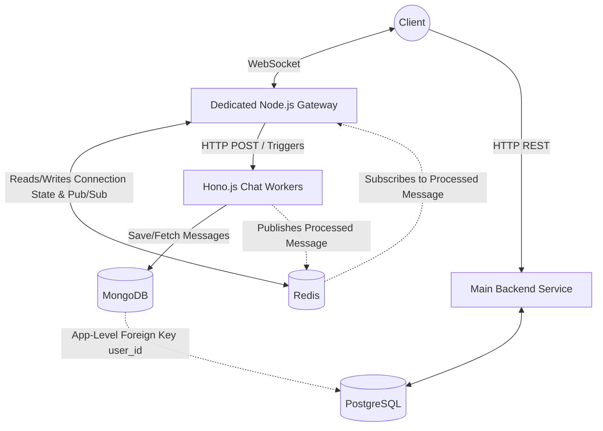

# Chat Microservice Architecture Documentation

## Overview
This document outlines the proposed microservice architecture where the chat functionality is decoupled from the main backend. The chat system leverages **Hono.js for serverless workers**, a **dedicated Node.js server** as the API Gateway for managing persistent connections, an event-driven message bus, and a polyglot persistence strategy (PostgreSQL for main data, MongoDB for chat data). All components are fully Dockerized.

## Architecture Components

### 1. Main Backend (Monolith/Core Service)
- **Role:** Handles core business logic, user authentication, profile management, etc.
- **Database:** PostgreSQL.
- **Responsibility:** Manages primary relational data and publishes lifecycle events to the Event Bus.

### 2. API Gateway (Dedicated Node.js Server)
- **Role:** Acts as the entry point for chat connections (WebSockets).
- **Tech Stack:** Node.js, Socket.IO, Docker.
- **State Management:** Maintains persistent connections with clients. It uses an **In-Memory Store (Redis)** to map active WebSockets to users.
- **Responsibility:** Receives incoming chat messages from clients over WebSockets and forwards them to the Hono.js workers. It also listens for outgoing messages from the workers to push back to connected clients.

### 3. Serverless Chat Workers (Hono.js)
- **Role:** Ephemeral compute logic that processes chat messages.
- **Tech Stack:** Hono.js, Docker.
- **Responsibility:** Handles message parsing, validation, formatting, and saving messages to the database.
- **Behavior:** Triggered by the API Gateway via HTTP or Event Bus. They perform business logic, write to MongoDB, and publish an event back (via Redis Pub/Sub) so the Gateway can broadcast the message to the recipient.

### 4. Event Bus / Broker (Redis / RabbitMQ)
- **Role:** Asynchronous message broker.
- **Responsibility:** 
  1. Handles cross-service communication (e.g., User Deleted in PostgreSQL -> Clean up MongoDB).
  2. Enables communication between the Hono.js workers and the Node.js API Gateway for message delivery.

### 5. Database Layer & Consistency
- **Main Database:** PostgreSQL (Stores Users, Workspaces, etc.)
- **Chat Database:** MongoDB (Stores chat history, messages, attachments).
- **Consistency Strategy:** 
  - The databases are kept eventually consistent using an application-level **Foreign Key** reference.
  - Since this is a new application, no data migration is needed for existing chats; data can be dropped if schema changes occur.

## Architecture Flow Diagram

## Scalability Analysis: Would It Scale?

**Yes, this architecture is highly scalable and designed to handle massive traffic spikes.**

1. **Dockerized Hono.js Workers:**
   - Hono.js is incredibly lightweight and fast. Running it in Docker containers allows you to scale the worker nodes instantly using Kubernetes or Docker Swarm based on CPU load.
   
2. **Dedicated Node.js Gateway + Redis:**
   - The Gateway's only job is to hold WebSocket connections and route them. It doesn't block on heavy DB operations. Redis acts as a Pub/Sub backbone, allowing you to run multiple Gateway instances. If User A is connected to Gateway 1 and User B is on Gateway 2, Redis ensures messages bridge across them seamlessly.

3. **MongoDB for Chat Data:**
   - MongoDB is natively designed for horizontal scaling (Sharding) and handles high-volume write operations much better than traditional relational databases.

## Pros and Cons

### Pros
1. **Massive Independent Scalability:** WebSockets (Gateway) and Processing (Workers) are decoupled. You can scale the gateway for more connections, and the workers for heavier logic independently.
2. **Modern Stack:** Hono.js provides excellent performance and is perfectly suited for edge/serverless paradigms.
3. **High Performance:** Redis for connection mapping ensures the API gateway remains lightning fast.
4. **Clean Slate:** No legacy data migration issues.

### Cons & Potential Challenges
1. **Increased Architectural Complexity:** Managing a Main Backend, a Node Gateway, Hono Workers, Postgres, Mongo, and Redis requires robust orchestration (which Docker Compose will help mitigate).
2. **Inter-Service Communication Latency:** Passing a message from WebSocket -> Gateway -> Hono Worker -> Redis -> Gateway -> WebSocket adds minimal network hops. Ensure containers are deployed in the same private network.
3. **Cloudflare Edge Deployment:** If deploying Hono specifically to Cloudflare Edge in the future, Dockerization is only for local dev/testing, as Cloudflare runs isolates natively, not Docker.
